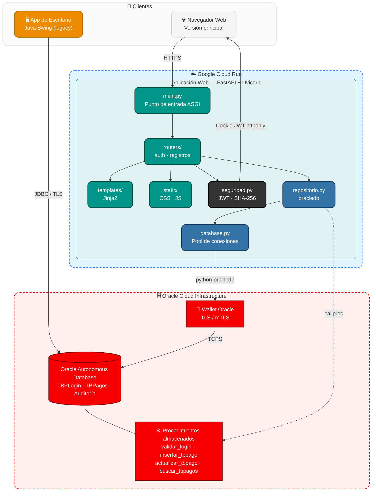

# PRPagos


Aplicación para la gestión de pagos, con persistencia en Oracle Autonomous
Database. Desarrollada originalmente durante el curso de Desarrollo de
Software de la Universidad EAN.

El repositorio tiene dos versiones independientes de la misma aplicación,
que comparten la misma base de datos:

- **[`escritorio/`](./escritorio)** — la aplicación original en Java/Swing,
  para quien prefiera correrla localmente.
- **[`web/`](./web)** — versión web en Spring Boot (Java 21, Thymeleaf),
  desplegada en Google Cloud Run.

Ver [`CHANGELOG-migracion.md`](./CHANGELOG-migracion.md) para el detalle de
la migración de escritorio a web.

## Funcionalidades

- Registro e inicio de sesión de usuarios
- Registro, consulta y actualización de pagos
- Cada usuario ve únicamente sus propios pagos
- Rol Administrador de solo lectura: consulta los pagos de todos los
  usuarios sin poder modificarlos
- Exportar pagos a CSV
- Registro de auditoría de las operaciones

## Estructura del repositorio

```
escritorio/    Aplicación de escritorio en Java (Swing)
web/           Aplicación web en Java (Spring Boot + Thymeleaf)
sql/           Tablas, secuencias y procedimientos almacenados (compartido)
wallet/        Wallet de Oracle Autonomous Database (compartido, no se sube a git)
docs/          Documentación adicional (compartido)
```

## Arquitectura



`sql/`, `wallet/` y `docs/` están en la raíz porque los usan tanto
`escritorio/` como `web/`: ambas versiones hablan con la misma base de
datos y usan el mismo Wallet para conectarse.

## Base de datos

Requiere una base Oracle accesible (Oracle Autonomous Database tiene un
plan gratuito permanente). Ejecutar `sql/DBPagos.sql` crea las tablas, las
secuencias, los procedimientos almacenados y la tabla de auditoría —
solo hace falta hacerlo una vez, sin importar qué versión (escritorio o
web) se vaya a usar.

Si la base es Oracle Autonomous Database, la conexión es por TLS mediante
un Wallet: hay que descargarlo desde la consola de Oracle Cloud y ubicarlo
en `wallet/` (o donde indique la configuración de cada versión).

## Seguridad

Las contraseñas se almacenan con hash, nunca en texto plano, y ese hash es
el mismo en ambas versiones para que una cuenta funcione desde cualquiera
de las dos interfaces. La visibilidad de los pagos está limitada por
usuario, y el procedimiento de actualización verifica la autorización
antes de modificar un registro — esa regla vive en la base de datos, no en
ninguna de las dos aplicaciones cliente.

Para instrucciones de configuración y ejecución de cada versión, ver el
`README.md` dentro de `escritorio/` y de `web/`.

## Despliegue

La base de datos corre en Oracle Autonomous Database (OCI, plan Always
Free). La aplicación web (`web/`) está desplegada en Google Cloud Run.

## Autor

**Luis Felipe Arias Carriazo**
[GitHub](https://github.com/lariasca1994) · [LinkedIn](https://linkedin.com/in/lfac1)