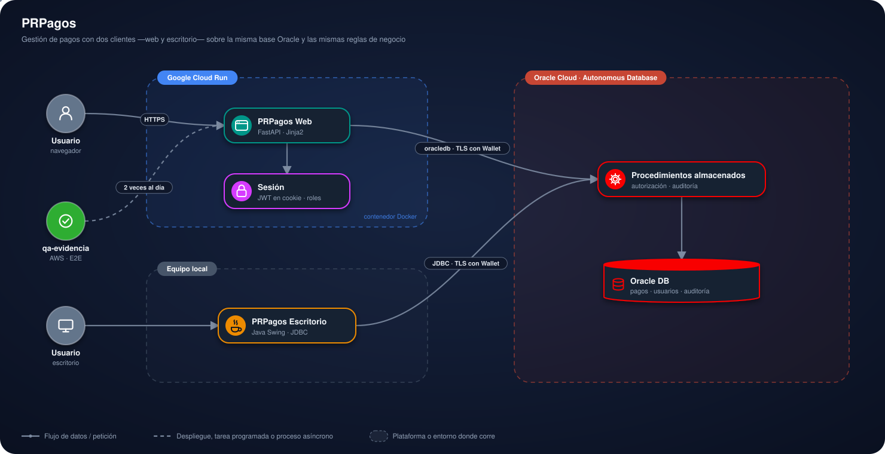

# PRPagos

<p>
  <a href="https://prpagos-web-1087929107584.southamerica-east1.run.app"></a>
  <a href="https://frontend-nine-topaz-99.vercel.app"></a>
  <a href="https://d4i3vsgw7xwmh.cloudfront.net"></a>
</p>


Aplicación para la gestión de pagos, con persistencia en Oracle Autonomous
Database. Desarrollada originalmente durante el curso de Desarrollo de
Software de la Universidad EAN.

El repositorio tiene dos versiones independientes de la misma aplicación,
que comparten la misma base de datos:

- **[`escritorio/`](./escritorio)** — la aplicación original en Java/Swing,
  para quien prefiera correrla localmente.
- **[`web/`](./web)** — versión web en Python (FastAPI + Jinja2),
  desplegada en Google Cloud Run.

Ver [`CHANGELOG-migracion.md`](./CHANGELOG-migracion.md) para el detalle de
la migración de escritorio a web.

### En pocas palabras

- **Qué hace:** permite registrar, consultar, modificar y exportar pagos. Cada
  persona ve solo sus propios pagos; el administrador ve y gestiona todos.
- **Qué lo hace interesante:** hay dos aplicaciones (web y escritorio) que usan
  **la misma base de datos y las mismas reglas**, porque la autorización y la
  auditoría viven en procedimientos almacenados de Oracle, no en el código de
  cada cliente.
- **Cómo probarlo:** entra a la [demo web](https://prpagos-web-1087929107584.southamerica-east1.run.app)
  y crea un usuario. Para correrlo en tu equipo, ve a
  [Cómo ejecutarlo](#cómo-ejecutarlo).

## Arquitectura

<p align="center">
  
</p>

- **Google Cloud Run** corre la versión web (FastAPI + Jinja2) en un contenedor
  Docker; la sesión viaja en un JWT dentro de una cookie.
- La **versión de escritorio** (Java Swing) corre en el equipo del usuario y se
  conecta por JDBC.
- Ambas llegan a **Oracle Autonomous Database** con TLS y Wallet, y llaman a los
  mismos procedimientos almacenados, que verifican la autorización y registran
  la auditoría.
- **qa-evidencia** prueba la versión web automáticamente dos veces al día.

## Funcionalidades

- Registro e inicio de sesión de usuarios
- Registro, consulta y actualización de pagos
- Cada usuario ve únicamente sus propios pagos
- Rol Administrador: consulta, modifica y elimina los pagos de todos los
  usuarios, y gestiona las cuentas (suspender, reactivar, eliminar)
- Exportar pagos a CSV
- Registro de auditoría de las operaciones

## Estructura del repositorio

```
escritorio/    Aplicación de escritorio en Java (Swing)
web/           Aplicación web en Python (FastAPI + Jinja2)
sql/           Tablas, secuencias y procedimientos almacenados (compartido)
wallet/        Wallet de Oracle Autonomous Database (compartido, no se sube a git)
docs/          Documentación adicional (compartido)
```

`sql/`, `wallet/` y `docs/` están en la raíz porque los usan tanto
`escritorio/` como `web/`: ambas versiones hablan con la misma base de
datos y usan el mismo Wallet para conectarse.

## Base de datos

Requiere una base Oracle accesible (Oracle Autonomous Database tiene un
plan gratuito permanente). Ejecutar `sql/DBPagos.sql` crea las tablas, las
secuencias, los procedimientos almacenados y la tabla de auditoría —
solo hace falta hacerlo una vez, sin importar qué versión (escritorio o
web) se vaya a usar.

Si la base es Oracle Autonomous Database, la conexión es por TLS mediante
un Wallet: hay que descargarlo desde la consola de Oracle Cloud y ubicarlo
en `wallet/` (o donde indique la configuración de cada versión).

## Seguridad

Las contraseñas se almacenan con hash, nunca en texto plano, y ese hash es
el mismo en ambas versiones para que una cuenta funcione desde cualquiera
de las dos interfaces. La visibilidad de los pagos está limitada por
usuario, y el procedimiento de actualización verifica la autorización
antes de modificar un registro — esa regla vive en la base de datos, no en
ninguna de las dos aplicaciones cliente.

Para instrucciones de configuración y ejecución de cada versión, ver el
`README.md` dentro de `escritorio/` y de `web/`.

## Cómo ejecutarlo

1. **Base de datos (una sola vez):** ejecuta `sql/DBPagos.sql` en tu Oracle y
   deja el Wallet en `wallet/` (ver [Base de datos](#base-de-datos)).
2. **Versión web:**
   ```bash
   cd web
   python -m venv .venv
   .venv\Scriptsctivate          # Windows  (Linux/Mac: source .venv/bin/activate)
   pip install -r requirements.txt
   cp .env.example .env            # contraseña de la base y JWT_SECRET
   uvicorn app.main:app --reload
   ```
   Abre `http://localhost:8000`. Detalle en [`web/README.md`](./web/README.md).
3. **Versión de escritorio:** abre `escritorio/` en Eclipse o VS Code, agrega
   `lib/ojdbc17.jar` y `lib/oraclepki.jar` al classpath y ejecuta
   `com.prpagos.ui.VentanaLogin`. Detalle y comandos de consola en
   [`escritorio/README.md`](./escritorio/README.md).

## Despliegue

La base de datos corre en Oracle Autonomous Database (OCI, plan Always
Free). La aplicación web (`web/`) está desplegada en Google Cloud Run.

## Autor

**Luis Felipe Arias Carriazo**
[GitHub](https://github.com/lariasca1994) · [LinkedIn](https://linkedin.com/in/lfac1)