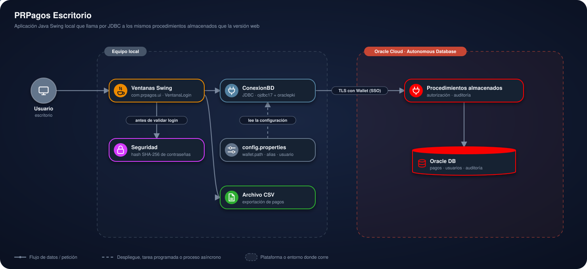

# PRPagos Escritorio

<p>
  <a href="https://prpagos-web-1087929107584.southamerica-east1.run.app"></a>
  <a href="https://frontend-nine-topaz-99.vercel.app"></a>
  <a href="https://d4i3vsgw7xwmh.cloudfront.net"></a>
</p>


## Contenido

1. [Presentación](#1-presentación)
2. [Estructura del proyecto](#2-estructura-del-proyecto)
3. [Arquitectura](#3-arquitectura)
4. [Plataformas y su función](#4-plataformas-y-su-función)
5. [Cómo usar la plataforma](#5-cómo-usar-la-plataforma)
6. [Instalación para pruebas](#6-instalación-para-pruebas)
7. [Autor y licencia](#7-autor-y-licencia)

---

## 1. Presentación

Versión de escritorio de PRPagos, construida con Java Swing. Es la aplicación
original, y habla con la **misma** base de datos, el **mismo** Wallet de
Oracle y los **mismos** procedimientos almacenados que la versión web
([`../web`](../web)).

Ver el [`README.md`](../README.md) de la raíz para la descripción general del
proyecto y [`CHANGELOG-migracion.md`](../CHANGELOG-migracion.md) para el
detalle de la migración.

### En pocas palabras

- **Qué hace:** permite registrar, consultar, modificar y exportar pagos desde
  una aplicación de escritorio. Cada persona ve solo sus propios pagos.
- **Qué lo hace interesante:** el código Java no reimplementa las reglas: la
  autorización y la auditoría viven en procedimientos almacenados de Oracle,
  los mismos que usa la versión web.
- **Cómo probarlo:** se ejecuta en tu equipo; ve a
  [Instalación para pruebas](#6-instalación-para-pruebas). Para probar sin
  instalar nada, usa la [demo web](https://prpagos-web-1087929107584.southamerica-east1.run.app),
  que comparte la misma base.

### Demo en vivo

La versión de escritorio no tiene demo en línea: se ejecuta en el equipo de
cada usuario.

**Versión web (misma base de datos):** [abrir la demo en vivo](https://prpagos-web-1087929107584.southamerica-east1.run.app)

### Funcionalidades

**Cuentas**
- Registro e ingreso con contraseñas hasheadas (el usuario es un correo
  `@EAN.com`)
- Recuperación de contraseña
- La misma cuenta sirve en la versión web

**Pagos**
- Ingresar, consultar y modificar pagos
- Filtros por concepto, monto y rango de fechas
- Selector de fechas mediante calendario
- Exportar la consulta a CSV
- Cada usuario ve y modifica únicamente sus propios pagos

**Auditoría**
- Cada operación queda registrada por la base de datos

### Stack

| Capa | Tecnología |
|---|---|
| Interfaz | Java Swing |
| Lenguaje | Java 17 |
| Acceso a datos | JDBC (ojdbc17 + oraclepki) |
| Base de datos | Oracle Autonomous Database |
| Reglas de negocio | Procedimientos almacenados PL/SQL |
| Contraseñas | SHA-256, compatible con la versión web |
| Despliegue | Equipo local |

---

## 2. Estructura del proyecto

```
escritorio/
├── config.properties.example   Plantilla de configuración
├── lib/                         Drivers de Oracle (ojdbc17, oraclepki)
├── resources/                   Icono de la aplicación
└── src/main/java/com/prpagos/
    ├── conexion/    ConexionBD — punto único de conexión a la base (Wallet)
    ├── seguridad/   Seguridad — hash de contraseñas (SHA-256)
    └── ui/          Ventanas Swing (Login, Principal, ConsultaPagos,
                     IngresoPago, ModificarPago, CrearUsuario,
                     RecuperarContrasena, SelectorFecha, Iconos)
```

Las tablas y procedimientos (`../sql/`) y el Wallet (`../wallet/`) están en
la raíz del repositorio, compartidos con la versión web.

---

## 3. Arquitectura

<p align="center">
  
</p>

- La aplicación corre en el **equipo del usuario**; la ventana de inicio es
  `com.prpagos.ui.VentanaLogin`.
- **Seguridad** calcula el hash SHA-256 de la contraseña antes de validar el
  login.
- **ConexionBD** es el punto único de conexión: lee `config.properties` y se
  conecta por JDBC con TLS usando el **Wallet** (SSO, sin contraseña).
- Los **procedimientos almacenados** de Oracle deciden qué pagos ve cada
  usuario, verifican la autorización y registran la auditoría.
- La consulta de pagos se puede exportar a un **archivo CSV** local.

### Seguridad

- Las contraseñas se guardan con hash SHA-256, nunca en texto plano, y es el
  mismo hash que usa la versión web: una cuenta funciona desde cualquiera de
  las dos interfaces.
- Un usuario solo puede ver y modificar sus propios pagos; esa regla vive en
  los procedimientos almacenados (`buscar_tbpagos`, `actualizar_tbpago`), no
  se reimplementa en el código Java.
- Conexión a la base por TLS con Wallet.
- El Wallet y `config.properties` no se suben al repositorio.

---

## 4. Plataformas y su función

| Plataforma | Función en el proyecto |
|---|---|
|  | La aplicación corre en el equipo de cada usuario, sin servidor. |
|  | Oracle Autonomous Database guarda usuarios y pagos, y ejecuta los procedimientos almacenados con las reglas y la auditoría. Conexión por TLS con el Wallet; no requiere ningún otro servicio, cuenta ni clave de API. |
|  | Conecta la aplicación con la base mediante los drivers `ojdbc17` y `oraclepki`. |

---

## 5. Cómo usar la plataforma

### 5.1 Crear una cuenta

1. En la ventana **Login**, pulsa **Crear Usuario**.
2. Completa **Usuario (correo @EAN.com)**, **Nombre** y **Contraseña**.
3. Pulsa **Crear**. La misma cuenta sirve en la versión web.

### 5.2 Iniciar sesión

En **Login**, escribe **Usuario** y **Contraseña** y pulsa **Ingresar**. Se abre la
ventana **Sistema de Pagos**, con **Consultar Pagos**, **Ingresar Pago** y **Salir**.

### 5.3 Ingresar un pago

1. Pulsa **Ingresar Pago**.
2. Completa **Monto**, **Fecha** (con el selector de calendario) y **Concepto**.
3. Pulsa **Agregar**.

### 5.4 Consultar, modificar y exportar

1. Pulsa **Consultar Pagos**.
2. Filtra con **Concepto contiene**, **Monto mín** y **Monto máx**, y marca **Filtrar
   por fecha** para usar **Desde** y **Hasta**. Pulsa **Buscar** (**Limpiar filtros**
   los quita).
3. La ventana muestra tus pagos y el **Total Pagado**.
4. Selecciona un pago y pulsa **Modificar Pago** para cambiar monto, fecha o
   concepto; confirma con **Modificar**.
5. **Exportar a CSV** guarda la consulta en un archivo local.

### 5.5 Recuperar la contraseña

1. En **Login**, pulsa **Olvidé mi contraseña**.
2. Escribe tu **Correo**, el **Nombre con el que te registraste** y la **Nueva
   Contraseña**, y pulsa **Enviar**.

---

## 6. Instalación para pruebas

### Requisitos

- JDK 17 o superior
- Una base Oracle accesible, preparada con `../sql/DBPagos.sql` (una sola vez)
- El Wallet de esa base descomprimido en `../wallet`. No viene en el
  repositorio: se descarga desde la consola de Oracle Cloud.
- Los drivers de `lib/` (ya incluidos en el repositorio)

### Instalación

```bash
git clone https://github.com/lariasca1994/PRPagos.git
cd PRPagos/escritorio

cp config.properties.example config.properties
```

### Configuración

La conexión se centraliza en `conexion/ConexionBD`. Sus parámetros se leen de
`config.properties`, no están escritos en el código: el alias de conexión
(de `wallet/tnsnames.ora`), el usuario y la contraseña de la base.

Como el Wallet está en la raíz del repositorio y no dentro de esta carpeta,
`wallet.path` debe apuntar a `../wallet`, que es el valor que ya trae la
plantilla. `config.properties` nunca se sube a git.

### Ejecución

Desde un IDE (Eclipse o VS Code): importar el proyecto, agregar
`lib/ojdbc17.jar` y `lib/oraclepki.jar` como Referenced Libraries / al
classpath, y ejecutar `com.prpagos.ui.VentanaLogin` como aplicación Java.

Desde consola (PowerShell, parado en `escritorio/`):

```powershell
javac -d bin -cp "lib\ojdbc17.jar;lib\oraclepki.jar" (Get-ChildItem -Recurse -Path src -Filter *.java | % FullName)
java -cp "bin;lib\ojdbc17.jar;lib\oraclepki.jar" com.prpagos.ui.VentanaLogin
```

En Linux o macOS el separador del classpath es `:` en lugar de `;`.

### Despliegue

La versión de escritorio se ejecuta localmente, con Oracle Autonomous
Database como base de datos. No requiere servidor.

---

## 7. Autor y licencia

**Luis Felipe Arias Carriazo**
[GitHub](https://github.com/lariasca1994) · [LinkedIn](https://linkedin.com/in/lfac1)

Licencia: MIT.
