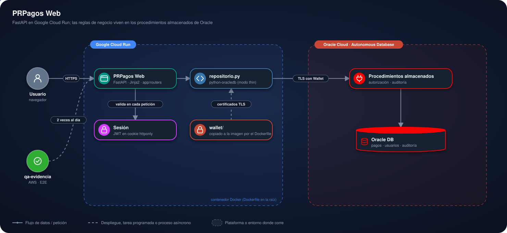

# PRPagos Web

<p>
  <a href="https://prpagos-web-1087929107584.southamerica-east1.run.app"></a>
  <a href="https://frontend-nine-topaz-99.vercel.app"></a>
  <a href="https://d4i3vsgw7xwmh.cloudfront.net"></a>
</p>


Versión web de PRPagos, construida con FastAPI. Habla con la **misma** base
de datos, el **mismo** Wallet de Oracle y los **mismos** procedimientos
almacenados que la versión de escritorio ([`../escritorio`](../escritorio)):
no es una reescritura de las reglas de negocio, es la misma aplicación
expuesta como páginas web en vez de ventanas Swing.

Ver el [`README.md`](../README.md) de la raíz para la descripción general del
proyecto y [`CHANGELOG-migracion.md`](../CHANGELOG-migracion.md) para el
detalle de la migración.

### En pocas palabras

- **Qué hace:** permite registrar, consultar, modificar y exportar pagos desde
  el navegador. Cada persona ve solo sus propios pagos.
- **Qué lo hace interesante:** la capa web no reimplementa las reglas: la
  autorización y la auditoría viven en procedimientos almacenados de Oracle,
  los mismos que usa la versión de escritorio.
- **Cómo probarlo:** entra a la [demo](https://prpagos-web-1087929107584.southamerica-east1.run.app)
  y crea un usuario. Para correrlo en tu equipo, ve a
  [Instalación](#instalación) y [Ejecución](#ejecución).

## Demo en vivo

**Aplicación:** [abrir la demo en vivo](https://prpagos-web-1087929107584.southamerica-east1.run.app)

## Funcionalidades

**Cuentas**
- Registro e ingreso con contraseñas hasheadas (el usuario es un correo
  `@EAN.com`)
- Recuperación de contraseña
- Sesión de hasta 8 horas en una cookie `httponly`
- La misma cuenta sirve en la versión de escritorio

**Pagos**
- Ingresar, consultar y modificar pagos
- Filtros por concepto, monto y rango de fechas
- Exportar la consulta a CSV
- Cada usuario ve y modifica únicamente sus propios pagos

**Auditoría**
- Cada operación queda registrada por la base de datos

Las rutas de pagos usan `/registros` en la URL en lugar de `/pagos`: algunos
antivirus con protección de banca en línea interceptan los formularios con
contraseña cuando la URL contiene "pagos".

## Stack

| Capa | Tecnología |
|---|---|
| Servidor | FastAPI, Uvicorn |
| Interfaz | Jinja2, HTML y CSS |
| Acceso a datos | python-oracledb (modo thin) |
| Base de datos | Oracle Autonomous Database |
| Reglas de negocio | Procedimientos almacenados PL/SQL |
| Sesiones | JWT (HS256) en cookie httponly |
| Contraseñas | SHA-256, compatible con la versión de escritorio |
| Despliegue | Docker en Google Cloud Run |

## Conexiones externas

| Servicio | Uso | Obligatorio |
|---|---|---|
| Oracle Autonomous Database | Persistencia, reglas de negocio y auditoría | Sí |

La conexión es por TLS con el Wallet de Oracle. No requiere ningún otro
servicio, cuenta ni clave de API.

## Arquitectura

<p align="center">
  
</p>

- **Google Cloud Run** corre una sola app FastAPI en un contenedor Docker:
  páginas Jinja2 protegidas por una sesión JWT en cookie.
- Cada petición **valida la sesión** antes de responder.
- `repositorio.py` concentra el acceso a datos: usa `python-oracledb` en modo
  thin y el **Wallet**, copiado a la imagen al construirla, para conectarse
  por TLS.
- Los **procedimientos almacenados** de Oracle deciden qué pagos ve cada
  usuario, verifican la autorización y registran la auditoría.
- **qa-evidencia** prueba la demo automáticamente dos veces al día.

## Estructura

```
web/
├── requirements.txt
├── .env.example          Plantilla de configuración
└── app/
    ├── main.py           Punto de entrada y manejo de errores
    ├── config.py         Carga del .env
    ├── database.py       Conexión a Oracle con el Wallet
    ├── repositorio.py    Llamadas a los procedimientos almacenados
    ├── seguridad.py      Hash de contraseñas y sesiones JWT
    ├── dependencias.py   Identificación del usuario en cada petición
    ├── routers/          Rutas de autenticación y de pagos
    ├── templates/        Plantillas Jinja2
    └── static/           Hoja de estilos y tema
```

Las tablas y procedimientos (`../sql/`), el Wallet (`../wallet/`) y el
`Dockerfile` están en la raíz del repositorio, compartidos con la versión de
escritorio.

## Requisitos

- Python 3.11 o superior
- Una base Oracle accesible, preparada con `../sql/DBPagos.sql` (una sola vez)
- El Wallet de esa base descomprimido en `../wallet`. No viene en el
  repositorio: se descarga desde la consola de Oracle Cloud.

## Instalación

```bash
git clone https://github.com/lariasca1994/PRPagos.git
cd PRPagos/web

python -m venv .venv
.venv\Scripts\Activate.ps1        # Windows
source .venv/bin/activate         # Linux o macOS

pip install -r requirements.txt
cp .env.example .env
```

Si PowerShell bloquea la activación del entorno:

```powershell
Set-ExecutionPolicy -Scope Process -ExecutionPolicy RemoteSigned
```

### Configuración

El `.env` necesita la ruta y la contraseña del Wallet, el alias de conexión
(de `wallet/tnsnames.ora`), el usuario y la contraseña de la base, y un
secreto propio para las sesiones:

```bash
python -c "import secrets; print(secrets.token_urlsafe(48))"
```

- `JWT_SECRET` firma las sesiones

La plantilla indica el nombre y el propósito de cada variable. El `.env`
nunca se sube a git.

## Ejecución

```bash
cd web
uvicorn app.main:app --reload
```

El `cd web` es necesario: las rutas de plantillas y archivos estáticos se
resuelven desde ahí.

| Recurso | Dirección |
|---|---|
| Aplicación | `http://127.0.0.1:8000` |
| Documentación de la API | `http://127.0.0.1:8000/docs` |

## Seguridad

- Las contraseñas se guardan con el mismo hash SHA-256 que usa la tabla
  `TBPLogin` desde la versión de escritorio, para que un usuario pueda
  iniciar sesión desde cualquiera de las dos interfaces sin migrar datos.
- Sesión en cookie `httponly` y `SameSite=Lax`: JavaScript no puede leer el
  token.
- Un usuario solo puede ver y modificar sus propios pagos; esa regla vive en
  los procedimientos almacenados (`buscar_tbpagos`, `actualizar_tbpago`), no
  se reimplementa en la capa web.
- Los errores de base de datos muestran un mensaje genérico; el detalle queda
  solo en el log del servidor.
- El Wallet y el `.env` no se suben al repositorio.

## Despliegue

La aplicación corre en Google Cloud Run, con Oracle Autonomous Database como
base de datos.

La imagen se construye con el `Dockerfile` de la **raíz** del repositorio,
porque necesita copiar tanto `web/app/` como `wallet/`. Desde la raíz:

```bash
gcloud run deploy <nombre-del-servicio> --source . --region <region>
```

- `.gcloudignore` decide qué se sube a Cloud Build. Sin él, `gcloud` usaría
  `.gitignore` y dejaría afuera `wallet/`, que la imagen necesita.
- Las variables del `.env` se configuran como variables de entorno del
  servicio en Cloud Run, nunca como un archivo dentro de la imagen.

## Autor

**Luis Felipe Arias Carriazo**
[GitHub](https://github.com/lariasca1994) · [LinkedIn](https://linkedin.com/in/lfac1)
